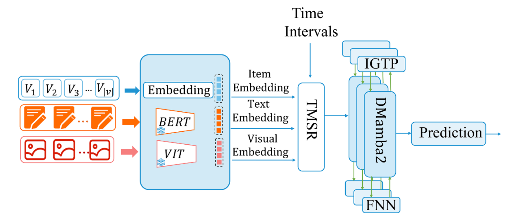
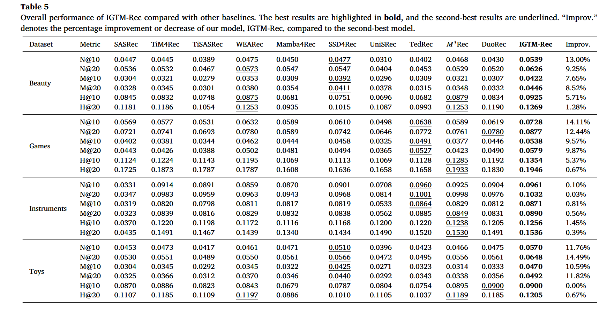

<p align="center">
  <a href="./README.md"></a>
  <a href="./README_zh.md"></a>
</p>
  

# Breaking sequential bias: Importance-guided temporal multimodal recommendation via state space models

## Project Structure

```
IGTM-Rec/
├── datasets                 # Dataset folder
├── main.py                  # Training and evaluation entry point
├── IGTMRec.py               # Core model implementation
├── custom_utils.py          # Custom dataset & DataLoader
├── custom_trainer.py        # Custom trainer (mixed precision training, evaluation, TensorBoard logging)
├── config.yaml              # Model and training hyperparameter configuration
├── environment.yaml         # Conda environment configuration
├── preprocess/
│   ├── readme.md            # Data download instructions
│   └── preprocess/
│       ├── data_preprocess.ipynb  # Data preprocessing (filtering, multimodal feature extraction)
│       ├── bert-base-uncased/     # BERT model for text feature extraction
│       ├── clip-vit-base-patch32/ # CLIP model for image feature extraction
│       └── coreml/                # Auxiliary resources
├── assets/
│   ├── model_architecture.png   # Model architecture diagram
│   └── results.png              # Experimental results
└── README.md
```

---

## Model Overview

### Architecture

This work is published on **ESWA (Expert Systems with Applications)**: [Breaking sequential bias: Importance-guided temporal multimodal recommendation via state space models](https://www.sciencedirect.com/science/article/pii/S0957417426021639)



## Introduction

**IGTM-Rec** is a novel multi-modal sequential recommendation framework designed to address two key challenges in existing methods: (1) the lack of temporal dynamics in multi-modal fusion, and (2) the overfitting issue caused by reliance on fixed sequential order. IGTM-Rec consists of two core components:

**TMSR (Time-aware Multi-Scale Routing)**

TMSR decouples feature processing into two levels:

- **Bottom layer**: Constructs a unified multi-modal representation through early fusion and extracts modal features at different temporal scales via multi-branch GTUs (Gated Temporal Units)
- **Top layer**: Utilizes physical time intervals as explicit prior signals to dynamically schedule gated temporal receptive fields of varying spans, enabling the model to adaptively select historical information based on real-time intervals

Unlike existing methods that treat time merely as an auxiliary feature or bias signal, TMSR emphasizes time as a **routing signal**, shifting the paradigm from "static fusion" to "time-driven routing" for more precise modeling of user interest evolution across different temporal granularities.

**IGTP (Importance-Guided Progressive Perturbation)**

IGTP is a training strategy that addresses sequential overfitting by assessing the importance of user interactions and **progressively perturbing** less significant sequential positions during training. Unlike indiscriminate augmentation strategies such as random masking or random shuffling, IGTP preserves core semantic structure while gradually reducing the model's dependence on fixed sequential order, thereby enhancing the robustness and generalization of learned user interest representations.

## Experimental Results



The model was evaluated on four Amazon public datasets (Beauty, Games, Toys, Musical Instruments) against various baseline models, using metrics including **NDCG@10/20**, **MRR@10/20**, and **Hit@10/20**. Experimental results demonstrate that IGTM-Rec achieves competitive performance across all datasets, with an average improvement of **6.51%**.

---

## Environment Setup

Install via Conda:

```bash
git clone https://github.com/zkLyons/IGTM-Rec.git
cd IGTM-Rec
conda env create -f environment.yaml
conda activate your_conda_env
```

All experiments were conducted on NVIDIA 24GB 3090 GPUs. Key dependencies include:

- Python 3.10
- PyTorch 2.1.1 + CUDA 11.8
- mamba-ssm 2.2.2
- RecBole 1.2.0
- causal-conv1d 1.4.0

## Dataset Acquisition

### 1. ID Data Processing

We use four Amazon public datasets (Beauty, Games, Toys, Musical Instruments). Setup steps:

1. Create a `dataset` folder
2. Download the dataset: [Google Drive](https://drive.google.com/drive/folders/1jsF4n1dge4KgdfD8HKxNjOcyHUKdEHka)
3. Place the data files into the `dataset/` directory

The dataset follows the RecBole Atomic File format (`.inter` files) with `user_id`, `item_id`, and `timestamp` fields.

### 2. Text and Image Feature Extraction

**Feature Extraction Model Acquisition**

Use `preprocess/preprocess/data_preprocess.ipynb` for multimodal feature extraction:

- **Text features**: Extracted using the `bert-base-uncased` model from item descriptions.
- **Image features**: Extracted using the `clip-vit-base-patch32` model from product images.

Running data_preprocess will automatically download the feature extraction models. If you encounter download issues, you can also manually download them from: [huggingface: bert-base-uncased](https://huggingface.co/google-bert/bert-base-uncased), [huggingface: clip-vit-base-patch32](https://huggingface.co/openai/clip-vit-base-patch32)

The extracted features are saved as `text_feat.pt` and `img_feat.pt`, and should be placed in the corresponding dataset subdirectory under `/dataset`.

**Text and Image Raw Data Acquisition**

Download the required data from Amazon: https://cseweb.ucsd.edu/~jmcauley/datasets/amazon_v2/

Two types of data are needed: **5-core** and **metadata**

After downloading, organize them by dataset and place them in the `preprocess` directory.

---

## Quick Start

Training and evaluation:

```bash
python main.py
```

### Configuration

All hyperparameters are configured in `config.yaml`, including:

| Parameter              | Description                   | Default Value |
| ---------------------- | ----------------------------- | ------------- |
| `hidden_size`          | Feature dimension             | 256           |
| `d_state`              | SSM state expansion dimension | 64            |
| `d_conv`               | Local convolution width       | 4             |
| `expand`               | Block expansion factor        | 2             |
| `headdim`              | Attention head dimension      | 16            |
| `num_layers`           | Number of IGTMRec layers      | 3             |
| `dropout_prob`         | Dropout probability           | 0.4           |
| `learning_rate`        | Learning rate                 | 0.0001        |
| `train_batch_size`     | Training batch size           | 1024          |
| `MAX_ITEM_LIST_LENGTH` | Maximum sequence length       | 200           |

To switch datasets, modify the corresponding dataset configuration block in `config.yaml`, uncommenting the desired dataset and commenting out others.

## Acknowledgements

This project is built upon the following excellent open-source works, for which we express our sincere gratitude:

- **Mamba / Mamba2**: [state-spaces/mamba](https://github.com/state-spaces/mamba) — State space models providing efficient sequence modeling backbones
- **RecBole**: [RUCAIBox/RecBole](https://github.com/RUCAIBox/RecBole) — Unified recommendation framework providing data processing, evaluation, and other infrastructure
- [SSD4Rec: A Structured State Space Duality Model for Efficient Sequential Recommendation](https://dl.acm.org/doi/10.1145/3773038)
- [M3Rec: Selective State Space Models with Mixture-of-Modality Experts for Multi-Modal Sequential Recommendation](https://github.com/Xu107/M3Rec-main)

---

## Citation

If you use IGTM-Rec in your research, please cite our paper:

```
@article{ZHANG2026133254,
title = {Breaking sequential bias: Importance-guided temporal multimodal recommendation via state space models},
journal = {Expert Systems with Applications},
volume = {331},
pages = {133254},
year = {2026},
issn = {0957-4174},
doi = {https://doi.org/10.1016/j.eswa.2026.133254},
url = {https://www.sciencedirect.com/science/article/pii/S0957417426021639},
author = {Kang Zhang and Quan Wen and Yujian Huang and Yanmei Hu and Ruixing Huang and Na Dong and Xiaomeng Yang and Shuyi Wang},
}
```
